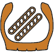

### Coreform Cubit toolbar for meshing 2D tire cross-sections. 

## Toolbar Installation:
  1. Clone the repository: git clone https://github.com/coreformllc/tire_cross_section_tool.git
  2. Run the packaging script.
      1. On Windows open a cmd prompt and run package.bat
      2. On Linux run ./package.sh
  3. Open Coreform Cubit
  4. Go to Tools/Custom Toolbar Editor.
  5. Right click in the upper left frame labeled Toolbars.
  6. Select Import.
  7. Using the Package option, select the downloaded tarball and a destination directory.
  8. Click on the Import push button.
  9. Click on the Finish push button.
*NOTE:* Requires Coreform Cubit 2025.11 or greater for PySide6 support.

## Usage
Once the toolbar is installed fourteen new icons will be displayed 
in the Coreform Cubit toolbar. 

Starting at the geometry icon these 
form a workflow for defining a tire mesh by progressing from left to right.
Some steps, such as blunting the geometry may be skipped and replaced 
by collapsing bad triangles at the end of the process. 

 - Create surfaces given a closed set of curves.

 - Create blocks assign some default names.

 - Modify the geometry to remove sharp tangencies.

 - Opens the Geometry/Surface/Split Surface command panel. The most commonly used option is "Close To Vertex". This option allows the user to specify multiple surfaces, a curve on one side of the split, and a curve on the opposite side. The split will occur along the closest point on the curve to the selected point.

 - Invokes the Cubit imprint and merge operations to ensure a conformal mesh.

 - Creates a quad dominant mesh on all surfaces.

 - Assigns element groups based on the "tip" of the tire near the bead.

 - Reflects a part created in the XY plane.

 - Defines rebar on 2xN mapped surfaces with a predefined block names, for example, any mapped block continaining the string "Belt."

 - Opens the Mesh/Node/Move Node command panel.

 - Does an undo back to cut lines. Note that manually defined composite curves may be lost.

 - Draw the sense of the rebar elements.

 - Collapse an edge and remove bad triangles.

## Creating an updated tarball
  1. Ensure that all changes to toolbar scripts are functioning in Cubit.
  2. Go to Tools/Custom Toolbar Editor.
  3. Right click in the upper left frame labeled Toolbars and Select Export.
  5. Select the export file location and name. The .tar.gz extension will be automatically added. The ... on the right hand side will open a file browser.
  6. Click on Next
  7. Check only the tire cross section toolbar and click Next.
  8. Click on Add Files. Browse into the scripts directory and select the cubit\_utils python file. 
  9. Click on Open. This will add a new folder called files.
  10. Open the files folder and drag the cubit\_utils.py into the 
  scripts folder.
  11. Right click on the files folder and select Remove selected.
  12. Click on Finish.

